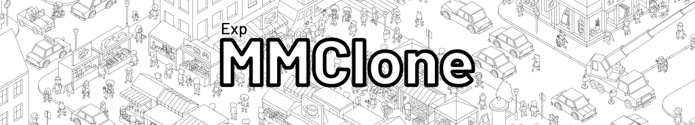

A Game Framework to load and play MicroMacro-like maps and cases.
Uses Leaflet to show the map.

You need to first load a map before being able to play. A test map is available through the menu (Click "Load Test Map").

## TODO:
- mp:
    - let users set color
    - let users select name?
    - make connecting less cbt
    - ping? => do direction effect on border when ping off screen
    - notify user that other user has changed/reset case
    - host migration/close lobby when host leaves
- right click menu:
    - delete all markers
    - debug:
        - on circle/shape: set color
- style markers (so you can see what you marked)
- help page + first time landing page/tutorial
- fix bounds on small images
- mark solved cards better in ui
- make objective display better on mobile
- add shake on mobile/general cards after waiting too long?
- add possibility to (temporarily) see unflipped card?
- save case progress
- save settings
- optimize loading (zip limited?)
- support multi-steps (each step gets a "depends on" array? `step1.dependsOn = [step1,step2]`?)
- show step progress (1/4) somewhere on mobile (card menu? corner?)
- finer file load progress bar (hook put onsuccess?)
- performance test loading (seperate zip and idb tests)
- hints
- add github link (to help menu?)
- tests??
- toolbar like debug menu for quick access?
- finish timer
- fix slides not being centered after resizing while case is finished (swiper is disabled)
- Ui shouldnt have to do case logic checks, mark step as unsolvable (in buildnodes?), only check that flag
- use card classes instead of adding card overlays for locked and solved?

# How to create a map from a image
To transform a image to raster tiles you can use libvips with this command:

`vips dzsave <image name> --layout google --tile-size 256 --overlap 0 <output name> --suffix .png`

Problems:
- libvips v8.14.2 doesn't contain dzsave rn because of some licensing issues. use v8.14.1
- if images are too small, you may need to adjust the zoom level manually. for a 1080x1920 image i had to use min zoom 8, max zoom 11